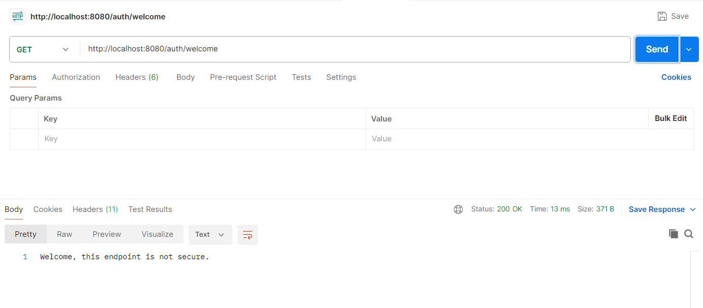
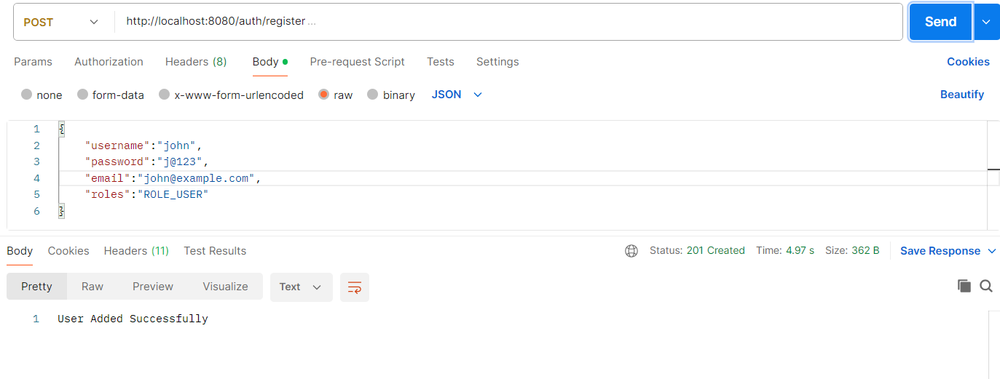
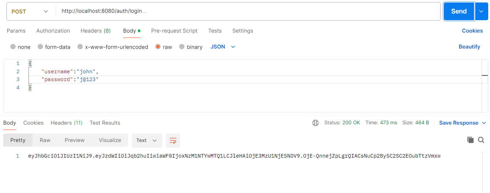
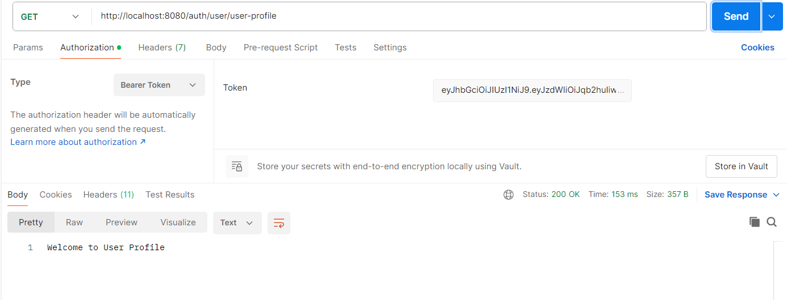
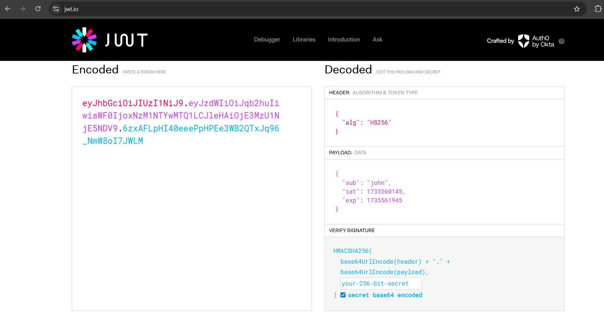
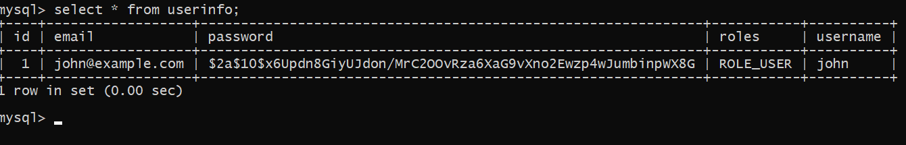

# JWT Authentication with Spring Boot

## Overview

This project demonstrates how to implement JWT (JSON Web Token) authentication in a Spring Boot application with Spring Security. It includes user registration, login, and JWT token generation, along with password hashing using BCrypt. Additionally, the system sends a welcome email to users upon successful registration.

## Features

- JWT authentication for secure API access.
- BCrypt password encryption.
- Email notification system for new user registration.
- Spring Boot-based backend with Spring Security integration.
- Easy-to-understand and extendable codebase.

## Technologies Used

- **Spring Boot**: Framework for building the application.
- **Spring Security**: For securing the APIs.
- **JWT (JSON Web Token)**: For user authentication and token-based session management.
- **BCrypt**: For secure password hashing.
- **Java Mail**: For sending emails to users.

## Prerequisites

Before you begin, ensure you have met the following requirements:

- Java 8 or higher.
- Maven (for dependency management and build automation).
- Spring Boot 3.x.
- Access to an SMTP server for email functionality.

## Installation

1. **Clone the Repository**:

   ```bash
   git clone https://github.com/ajay-kumbham/JWT-Authentication.git
   cd your-repository
   ```

2. **Configure Application Properties**:

   Edit `src/main/resources/application.properties` to include your SMTP server configuration and other necessary properties such as database and JWT secret key.

   ```properties
   spring.mail.host=smtp.yourmail.com
   spring.mail.port=587
   spring.mail.username=your-email@example.com
   spring.mail.password=your-email-password
   jwt.secret=your-jwt-secret
   ```
3. **Database Configuration**

   To configure the MySQL database, update the following properties in `src/main/resources/application.properties`:

   ```properties
   spring.datasource.url=jdbc:mysql://localhost:3306/your_database_name
   spring.datasource.username=your_database_username
   spring.datasource.password=your_database_password
   spring.jpa.hibernate.ddl-auto=update
   spring.jpa.properties.hibernate.dialect=org.hibernate.dialect.MySQL8Dialect
   ```

   Replace `your_database_name`, `your_database_username`, and `your_database_password` with your actual MySQL details.

4. **Build and Run the Application**:
   
   First, clean and install the dependencies by running:

   ```bash
   mvn clean install
   ```
   Using Maven, run the following command to build and start the application:

   ```bash
   mvn spring-boot:run
   ```

## API Endpoints

The following are the available API endpoints in the application:

### 1. **Welcome Endpoint** (Non-Secure)

- **Method**: `GET`
- **Endpoint**: `http://localhost:8080/auth/welcome`
- **Description**: A simple, non-secure endpoint to welcome users.

- **Response**:

   ```plaintext
   Welcome, this endpoint is not secure.

### 2. **Register User**

- **Method**: `POST`
- **Endpoint**: `http://localhost:8080/auth/register`
- **Description**: Registers a new user. A welcome email is sent upon successful registration.
- **Request Body**:

   ```json
   {
     "username": "user123",
     "password": "password123",
     "email": "user@example.com",
     "roles":"ROLE_USER"
   }
   ```

- **Response**:

   ```plaintext
   User Added Successfully. A welcome email has been sent.
   ```

### 3. **Login**

- **Method**: `POST`
- **Endpoint**: `http://localhost:8080/auth/login`
- **Description**: Logs in the user and returns a JWT token.
- **Request Body**:

   ```json
   {
     "username": "user123",
     "password": "password123"
   }
   ```

- **Response**:

   ```plaintext
   jwt-token
   ```

### 4. **Get User Profile**

- **Method**: `GET`
- **Endpoint**: `http://localhost:8080/user/user-profile`
- **Description**: Fetches the user's profile information. Requires authentication (JWT token).
- **Request Header**: `Authorization: Bearer <your-jwt-token>`

- **Response**:

   ```plaintext
   Welcome to User Profile.
   ```

## Testing with Postman

You can use Postman to test the endpoints. Here are the steps for each:

1. **Register User**: 

   - Set the HTTP method to `POST`.
   - Use the `http://localhost:8080/auth/register` endpoint.
   - Add the request body as shown above.
   - Press "Send" and check the response.

2. **Login**:

   - Set the HTTP method to `POST`.
   - Use the `http://localhost:8080/auth/login` endpoint.
   - Add the login credentials in the request body.
   - Press "Send" and retrieve the JWT token from the response.

3. **Get User Profile**:

   - Set the HTTP method to `GET`.
   - Use the `http://localhost:8080/user/user-profile` endpoint.
   - Add the `Authorization` header with the value `Bearer <your-jwt-token>`.
   - Press "Send" to view the profile data.

### Screenshots

screenshots of the API testing in Postman:

### 1. **Welcome Endpoint** (Non-Secure)
**Screenshot**:


---

### 2. **Register Endpoint**
**Screenshot**:


---

### 3. **Login Endpoint**
**Screenshot**:


---

### 4. **User Profile Endpoint**
**Screenshot**:


---

### 5. **JWT Token Encoding and Decoding**
Here’s how the JWT token is decoded using [JWT.io](https://jwt.io/).

**Screenshot**:


---

### 6. **MySQL Database (UserInfo Table)**
After registering a user, you can verify the data in the MySQL `UserInfo` table.
  
**Screenshot**:



## Contributing

Contributions are welcome! If you have suggestions for improvements or bug fixes, please open an issue or submit a pull request.

### How to Contribute:

1. Fork the repository.
2. Create a new branch (`git checkout -b feature/your-feature`).
3. Make your changes.
4. Commit your changes (`git commit -am 'Add feature'`).
5. Push to the branch (`git push origin feature/your-feature`).
6. Create a new pull request.

## License

This project is open-source and available under the [MIT License](LICENSE).

---

